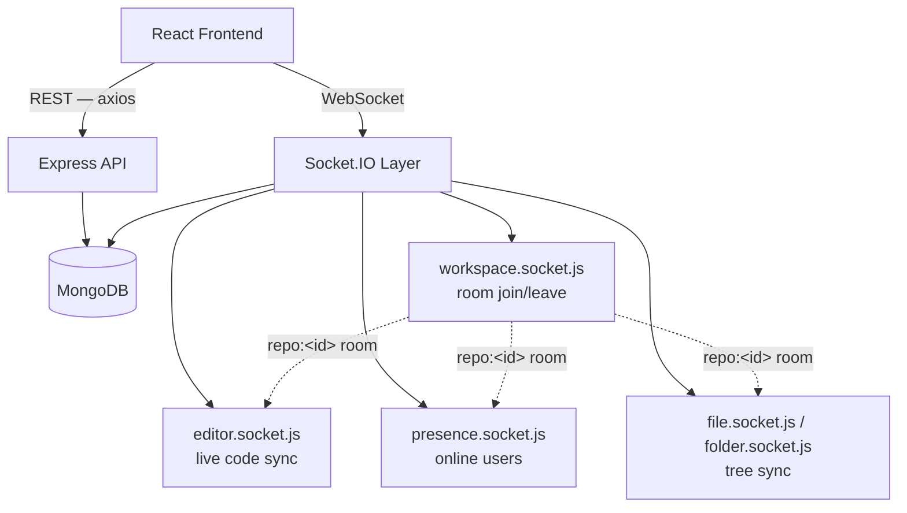

<div align="center">

# DevSync
### Real-Time Collaborative Development Workspace

*A repository-based workspace where multiple developers edit the same files at the same time — live code sync, live file-tree sync, and live presence, all over a single Socket.IO layer.*

[](#)
[](#)
[](#)
[](#)
[](#)

</div>

---

## Table of Contents

- [Overview](#overview)
- [Why This Project Exists](#why-this-project-exists)
- [Feature Highlights](#feature-highlights)
- [Architecture Overview](#architecture-overview)
- [Real-Time Event Model](#real-time-event-model)
- [Core Components](#core-components)
- [Feature Status](#feature-status)
- [Tech Stack](#tech-stack)
- [Project Structure](#project-structure)
- [Future Roadmap](#future-roadmap)
- [Documentation](#documentation)
- [Installation](#installation)
- [License](#license)

---

## Overview

DevSync is a repository-based real-time collaborative workspace. A repository is the core unit of collaboration — it holds files, folders, and collaborators — and every connected client sees changes to that repository the moment they happen, without commits, pushes, pulls, or manual file sharing.

The system pairs a standard REST API (auth, repositories, files, folders, invitations) with a Socket.IO layer that keeps everyone in a repository's "room" in sync: file tree changes, folder changes, live code edits, and who's currently online.

---

## Why This Project Exists

Most collaborative-development workflows are built around *asynchronous* handoffs — commit, push, pull, merge. That model is powerful, but it isn't built for two people editing the same file at the same moment. DevSync exists to explore the other half of collaboration:

- What does a repository-scoped real-time room actually look like under Socket.IO, end to end?
- How do you keep a file tree, an open editor, and a list of online users all consistent when three different clients can each trigger a change at once?
- Where does JWT-based auth need to be re-verified once you leave HTTP and move into a persistent socket connection?

Answering these required building the full loop — REST-backed persistence, a socket layer authenticated with the same JWTs as the API, and a real editor (Monaco) wired to both — rather than a UI mockup with fake sync.

---

## Feature Highlights

| | |
|---|---|
| ⚡ **Live Code Sync** | Monaco editor edits broadcast instantly to every other client with the same file open |
| 🗂️ **Live File-Tree Sync** | File/folder create, rename, and delete propagate to all connected collaborators in real time |
| 🟢 **Live Presence** | See exactly who's online in a repository right now, deduplicated across multiple tabs per user |
| 👥 **Invitations** | Send, receive, accept, or reject collaborator invitations to a repository |
| 🔐 **JWT-Authenticated Sockets** | The same JWT used for REST auth is re-verified at the Socket.IO handshake |
| 🖥️ **VS Code–Style Workspace** | File explorer, tabbed editor, and a collaboration panel in one layout |

---

## Architecture Overview



Every client that opens a workspace joins a `repo:<repositoryId>` Socket.IO room. Each handler (editor, presence, files, folders) broadcasts only within that room, so collaborators on different repositories never see each other's traffic.

A full component breakdown lives in the [Technical Requirements Document](2_TRD.md).

---

## Real-Time Event Model

| Event | Direction | Purpose |
|---|---|---|
| `workspace:join` / `workspace:joined` | client → server → client | Join a repository's room |
| `presence:update` | server → room | Broadcast current online users after any join/leave |
| `editor:join` | client → server | Announce which file a user has open |
| `editor:change` | client → server | User typed — send the new content |
| `editor:update` | server → room (except sender) | Propagate the change to everyone else with that file open |
| `file:created` / `file:renamed` / `file:deleted` | server → room | Keep every client's file tree in sync |
| `folder:created` / `folder:renamed` / `folder:deleted` | server → room | Keep every client's folder tree in sync |

Presence is deduplicated by `userId` (not `socketId`), so a user with the workspace open in two tabs still shows up once in the online list.

---

## Core Components

**`sockets/index.js` + `sockets/middleware.js`** — initializes the Socket.IO server and authenticates every incoming connection against the same JWT used by the REST API, before any handler runs.

**`handlers/workspace.socket.js`** — owns room membership: joining and leaving the `repo:<id>` room on connect/disconnect, and delegating to the other handlers.

**`handlers/presence.socket.js`** — an in-memory presence store (`repositoryId → socketId → userInfo`), intentionally not persisted to the database since it resets correctly on every server restart.

**`handlers/editor.socket.js`** — validates that a change actually came from a socket inside the relevant room before broadcasting it, then relays content to every other client with that file open.

**`handlers/file.socket.js` / `folder.socket.js`** — broadcast file-tree mutations so every open workspace reflects create/rename/delete operations without a manual refresh.

Design rationale and data structures for each are documented in [Backend Schema](5_BackendSchema.md).

---

## Feature Status

| Feature | Status |
|---|---|
| Authentication (JWT + bcrypt) | ✅ Working |
| Repository CRUD | ✅ Working |
| File & folder CRUD | ✅ Working |
| Real-time code sync | ✅ Working |
| Real-time file/folder sync | ✅ Working |
| Live presence | ✅ Working |
| Collaborator invitations | ✅ Working |
| Full workspace UI (explorer, tabs, editor, collab panel) | ✅ Working |
| ZIP export of a repository | ⬜ Not yet implemented |
| Breadcrumb navigation | ⬜ Not yet implemented |
| Centralized error-handling middleware | ⬜ Not yet implemented |
| Activity logs / version history | ⬜ Planned |

---

## Tech Stack

| Layer | Technology |
|---|---|
| Frontend | React 19, React Router, Tailwind CSS, Monaco Editor |
| Real-Time Client | Socket.IO Client |
| Backend | Node.js, Express 5 |
| Real-Time Server | Socket.IO (JWT-authenticated handshake) |
| Database | MongoDB + Mongoose |
| Auth | JWT + bcrypt |
| Build Tool | Vite |

---

## Project Structure

```
DevSync-RealtimeWorkspace/
├── backend/
│   └── src/
│       ├── controllers/    # authController, repositoryController, fileController, folderController, invitation.controller
│       ├── models/         # User, Repository, File, Folder, Invitation
│       ├── routes/         # Express routers per resource
│       ├── middleware/     # JWT auth middleware
│       ├── sockets/        # Socket.IO server init, event constants, auth middleware
│       └── handlers/       # workspace, editor, presence, file, folder socket handlers
│
└── frontend/
    └── src/
        ├── pages/          # LoginPage, RegisterPage, DashboardPage, WorkspacePage
        ├── features/
        │   ├── auth/       # LoginForm, RegisterForm, useLogin, useRegister
        │   ├── dashboard/  # RepoCard, CreateRepoModal, useDashboard
        │   └── workspace/  # FileTree, EditorPane, TabBar, PresenceList, InviteForm, useSocket, useEditor, useFileTree
        ├── services/       # axios-based API layer per resource
        └── lib/            # socket client factory, axios instance, Monaco config
```

---

## Future Roadmap

- [ ] ZIP export of a full repository
- [ ] Breadcrumb navigation in the editor toolbar
- [ ] Centralized backend error-handling middleware
- [ ] Activity logs and version history
- [ ] Repository snapshots
- [ ] Repository analytics

See [`7_FutureWhichWeNeverSee.md`](./7_FutureWhichWeNeverSee.md) for the full longer-term list.

---

## Documentation

| Document | Purpose |
|---|---|
| [Product Requirements](1_PRD.md) | Problem, objectives, scope, success metrics |
| [Technical Requirements](2_TRD.md) | Architecture, components, real-time design |
| [Application Flow](3_AppFlow.md) | Request lifecycle, sequence diagrams |
| [UI/UX Design Brief](4_UI-UX%20Brief.md) | Design philosophy, layout, user journey |
| [Backend Schema](5_BackendSchema.md) | Data structures, relationships, design rationale |
| [Implementation Plan](6_ImplementationPlan.md) | Milestones, development strategy |

---

## Installation

**Prerequisites:** Node.js 18+, a MongoDB connection (local or Atlas)

```bash
git clone <repo-url>
cd DevSync-RealtimeWorkspace

# Backend
cd backend
npm install

# Frontend
cd ../frontend
npm install
```

**`backend/.env`**
```
PORT=5000
MONGODB_URI=your_mongodb_connection_string
JWT_SECRET=your_jwt_secret
```

**`frontend/.env`**
```
VITE_API_BASE_URL=http://localhost:5000
VITE_SOCKET_URL=http://localhost:5000
```

```bash
# Backend (from /backend)
npm run dev

# Frontend (from /frontend, separate terminal)
npm run dev
```

Open `http://localhost:5173`.

<details>
<summary><strong>Troubleshooting</strong></summary>

| Problem | Fix |
|---|---|
| Socket won't connect / stuck "connecting" | Confirm `VITE_SOCKET_URL` matches the running backend port, and that the JWT token is present in `localStorage` |
| `401 Unauthorized` on API calls | Token missing or expired — log in again |
| Changes from another tab don't appear | Confirm both clients joined the same repository room (`workspace:joined` should fire in the browser console) |
| MongoDB connection error on boot | Check `MONGODB_URI` in `backend/.env` and that the MongoDB instance is reachable |

</details>

---

<div align="center">

**License:** Developed for educational and academic purposes.

</div>