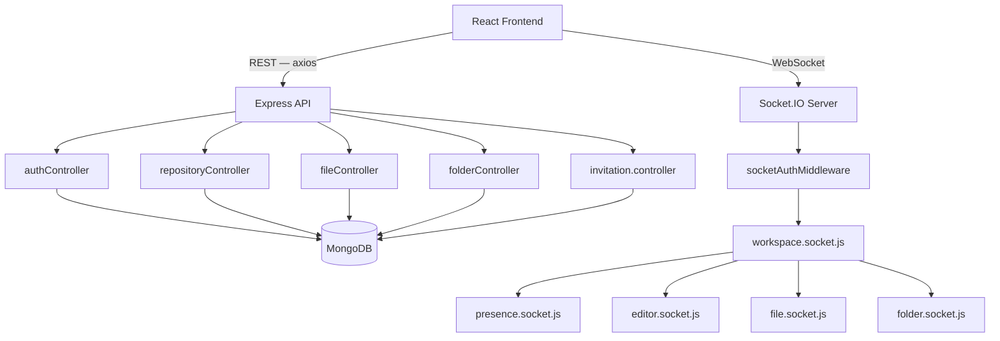

# Technical Requirements Document

**DevSync — Real-Time Collaborative Development Workspace**

*Defines system architecture, components, and technical implementation. For product scope, see the [PRD](1_PRD.md). For request-level flow, see [Application Flow](3_AppFlow.md).*

---

## Table of Contents

- [System Overview](#system-overview)
- [Architecture](#architecture)
- [Components](#components)
- [Module Responsibilities](#module-responsibilities)
- [Technology Choices](#technology-choices)
- [Real-Time Design](#real-time-design)
- [Data Flow](#data-flow)
- [API Surface](#api-surface)
- [Security](#security)
- [Scalability](#scalability)
- [Limitations](#limitations)

---

## System Overview

DevSync is a Node.js/Express backend exposing a REST API for persistence, paired with a Socket.IO layer for real-time synchronization, and a React frontend. A repository is the core unit of collaboration: it owns files, folders, and a list of collaborators. Every client currently viewing a repository joins a dedicated Socket.IO room for that repository, so edits, tree changes, and presence updates reach every collaborator without a page refresh.

---

## Architecture



---

## Components

| Component | Responsibility |
|---|---|
| `authController` | Registration, login (bcrypt + JWT), and profile retrieval |
| `repositoryController` | Repository CRUD, plus adding/listing/removing collaborators on a repository |
| `fileController` / `folderController` | CRUD for files and folders scoped to a repository |
| `invitation.controller` | Send, list (received), accept, and reject repository invitations |
| `socketAuthMiddleware` | Verifies the JWT sent in the Socket.IO handshake before a connection is allowed to proceed |
| `workspace.socket.js` | Owns room membership — joining/leaving a repository's `repo:<id>` room, and dispatching to the other handlers on connect |
| `presence.socket.js` | In-memory store of who is connected to which repository room; broadcasts on every join/leave |
| `editor.socket.js` | Validates and relays live code changes to everyone else with the same file open |
| `fileController` / `folderController` | Also broadcast file/folder create, rename, and delete events to a repository's room, via `getIO()`, immediately after persisting the change |

---

## Module Responsibilities

**`workspace.socket.js`** is the entry point for every authenticated socket connection. It registers the presence and editor handlers, then owns the `WORKSPACE_JOIN`/`WORKSPACE_LEAVE`/`disconnect` lifecycle: looking up the repository, moving the socket between rooms, and tracking the socket's current repository on `socket.data.currentRepository` so other handlers can validate against it.

**`presence.socket.js`** deliberately keeps state in memory (`repositoryId → socketId → { userId, username, socketId, joinedAt }`) rather than in MongoDB. Presence is a live-connection concept — it is correct for it to reset when the server restarts, since every socket disconnects at that point too. Deduplication happens by `userId` at read time, so a user with two tabs open in the same repository appears once in the broadcast list.

**`editor.socket.js`** checks that an incoming `editor:change` event's `repositoryId` matches the socket's actual current room (`socket.data.currentRepository`) before broadcasting — this prevents a stale or spoofed client from injecting changes into a room it isn't actually part of. Changes are relayed with `socket.broadcast.to(room)`, so the sender never receives its own echo.

**`repositoryController`** stores collaborators as an array of `User` references directly on the `Repository` document, rather than through a separate join model — access control for a repository is a membership check against this array plus the `owner` field.

**`fileController` / `folderController`** persist changes via REST and then call `getIO()` directly to emit `file:*`/`folder:*` events to the repository's room — real-time file-tree sync is driven from the controller layer, not from a dedicated socket handler. `handlers/file.socket.js` and `handlers/folder.socket.js` exist as placeholder files (`registerFileHandlers`/`registerFolderHandlers` with empty bodies) from an earlier planned design and are not currently used.

**`invitation.controller`** together with the `Invitation` model implements the actual access-granting flow: an invitation is created with `pending` status, optionally has a TTL-indexed `expiresAt`, and moves to `accepted` or `rejected` when the invited user responds. MongoDB's TTL index automatically removes expired invitation documents without a manual cleanup job.

---

## Technology Choices

| Choice | Rationale |
|---|---|
| Express 5 | REST API framework backing repository/file/folder/auth/invitation resources |
| Socket.IO | WebSocket layer with automatic fallback to polling, room support, and per-connection middleware — used for all real-time propagation |
| MongoDB + Mongoose | Document model fits the nested repository → folder → file relationship and collaborator arrays without a rigid relational schema |
| JWT (shared between REST and sockets) | A single token issued at login authenticates both HTTP requests (`Authorization` header) and the Socket.IO handshake (`auth.token`), avoiding a second auth mechanism for real-time |
| bcrypt | Standard password hashing for the `User` model |
| Monaco Editor | Same editor engine as VS Code, used client-side for the collaborative code-editing surface |
| React 19 + Vite | Frontend framework and build tool for the dashboard and workspace UI |

---

## Real-Time Design

### Room model
Every repository maps to a Socket.IO room named `repo:<repositoryId>`. A socket joins this room via `WORKSPACE_JOIN` and is tracked on `socket.data.currentRepository`; all subsequent handlers (presence, editor, file, folder) validate against this value before broadcasting, so events are scoped to the correct repository and never leak across rooms.

### Event catalog

| Event | Direction | Handler |
|---|---|---|
| `workspace:join` / `workspace:joined` | client ↔ server | `workspace.socket.js` |
| `workspace:leave` | client → server | `workspace.socket.js` |
| `presence:update` | server → room | `presence.socket.js` |
| `editor:join` | client → server | `editor.socket.js` |
| `editor:change` | client → server | `editor.socket.js` |
| `editor:update` | server → room (excludes sender) | `editor.socket.js` |
| `file:created` / `file:renamed` / `file:deleted` | server → room | `file.socket.js` |
| `folder:created` / `folder:renamed` / `folder:deleted` | server → room | `folder.socket.js` |
| `error` | server → client | any handler, on invalid payload or unauthorized action |

### Authentication at the socket layer
`socketAuthMiddleware` runs before `connection` is emitted: it reads `socket.handshake.auth.token`, verifies it with the same `JWT_SECRET` used by the REST API, loads the user, and attaches a minimal `{ _id, username, email }` to `socket.user`. A connection with a missing, invalid, or expired token is rejected before any handler executes.

---

## Data Flow

### Authentication
```
POST /api/auth/register → bcrypt.hash(password) → User.create() → 201
POST /api/auth/login    → User.findOne(email) → bcrypt.compare() → generateToken(userId) → JWT
```

### File/Folder Mutation
```
Client REST call → controller persists to MongoDB → controller returns response
                                                    → corresponding socket event broadcast to repo:<id> room
                                                    → other clients update their file tree without a refetch
```

### Live Editing
```
User types in Monaco → editor:change { repositoryId, fileId, content }
                     → editor.socket.js validates socket.data.currentRepository === repositoryId
                     → socket.broadcast.to(repo:<id>).emit(editor:update, { fileId, content })
                     → other clients with that file open apply the update
```

### Joining a Workspace
```
Client navigates to workspace → useSocket connects, emits workspace:join { repositoryId }
                              → workspace.socket.js verifies repository exists
                              → socket.join(repo:<id>) + presence add + broadcastPresence()
                              → socket receives workspace:joined { repositoryId, users }
```

---

## API Surface

**Auth**

| Method | Endpoint | Auth | Description |
|---|---|---|---|
| POST | `/api/auth/register` | — | Register a new user |
| POST | `/api/auth/login` | — | Log in, receive a JWT |
| GET | `/api/auth/profile` | ✅ | Get the authenticated user's profile |

**Repositories**

| Method | Endpoint | Auth | Description |
|---|---|---|---|
| POST | `/api/repositories` | ✅ | Create a repository |
| GET | `/api/repositories` | ✅ | List the user's repositories |
| GET | `/api/repositories/:id` | ✅ | Get a repository by ID |
| PUT | `/api/repositories/:id` | ✅ | Update a repository |
| DELETE | `/api/repositories/:id` | ✅ | Delete a repository |
| POST | `/api/repositories/:id/collaborators` | ✅ | Add a collaborator |
| GET | `/api/repositories/:id/collaborators` | ✅ | List collaborators |
| DELETE | `/api/repositories/:id/collaborators/:userId` | ✅ | Remove a collaborator |

**Files & Folders**

| Method | Endpoint | Auth | Description |
|---|---|---|---|
| POST | `/api/files/:repositoryId` | ✅ | Create a file |
| GET | `/api/files/:repositoryId` | ✅ | List files in a repository |
| GET | `/api/files/single/:fileId` | ✅ | Get a single file |
| PUT | `/api/files/:fileId` | ✅ | Update a file |
| DELETE | `/api/files/:fileId` | ✅ | Delete a file |
| POST | `/api/folders/:repositoryId` | ✅ | Create a folder |
| GET | `/api/folders/:repositoryId` | ✅ | List folders in a repository |
| PUT | `/api/folders/:folderId` | ✅ | Update a folder |
| DELETE | `/api/folders/:folderId` | ✅ | Delete a folder |

**Invitations**

| Method | Endpoint | Auth | Description |
|---|---|---|---|
| POST | `/api/invitations` | ✅ | Send an invitation |
| GET | `/api/invitations/received` | ✅ | List invitations received by the user |
| PUT | `/api/invitations/:invitationId/accept` | ✅ | Accept an invitation |
| PUT | `/api/invitations/:invitationId/reject` | ✅ | Reject an invitation |

All ✅ routes require `Authorization: Bearer <token>` and pass through the `protect` middleware.

---

## Security

- Passwords are hashed with bcrypt before storage; plaintext passwords are never persisted.
- REST routes are protected by JWT verification middleware (`protect`) that attaches the resolved user to `req.user`.
- Socket.IO connections are authenticated at the handshake via the same JWT, using a dedicated `socketAuthMiddleware` — a socket cannot join `connection` at all without a valid token.
- Editor and file/folder events are validated against the socket's tracked current room before being broadcast, preventing a connected-but-uninvited socket from injecting changes into a repository room it hasn't joined.
- There is currently no centralized error-handling middleware (`errorMiddleware.js` is an unimplemented stub) — each controller handles its own try/catch and error response shape.

---

## Scalability

The current build runs as a single Node.js process handling both the REST API and the Socket.IO server, with an in-memory presence store scoped to that process. This is appropriate for the project's target scale (small teams, classroom, hackathon use) but does not yet support horizontal scaling — running multiple server instances would require a shared presence/adapter layer (e.g. the Socket.IO Redis adapter) so rooms and presence stay consistent across instances. This is a known, intentional limitation of the current scope rather than an oversight.

---

## Limitations

- **No centralized error handling** — `middleware/errorMiddleware.js` exists as a file but is currently empty; error responses are shaped per-controller.
- **No dedicated Collaborator model** — collaborators are stored as a `User` reference array directly on `Repository`; `models/Collaborator.js` and `controllers/collaboratorController.js` are present as empty stubs, not currently used.
- **No dedicated file/folder socket handlers** — `handlers/file.socket.js` and `handlers/folder.socket.js` are empty placeholders; real-time file/folder broadcasts are emitted directly from `fileController`/`folderController` instead.
- **No repository export** — `services/exportService.js` and `utils/zipRepository.js` are present as empty stubs; ZIP export is not yet functional.
- **In-memory presence only** — presence state is not persisted and does not survive a server restart (by design, see [Real-Time Design](#real-time-design)).
- **Single-instance only** — no multi-node/horizontal scaling support in the current architecture.