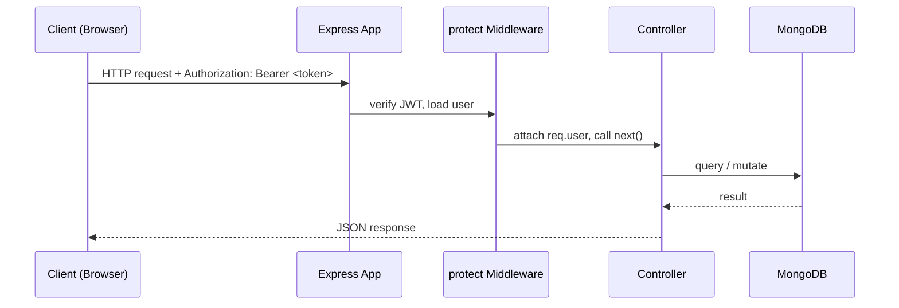
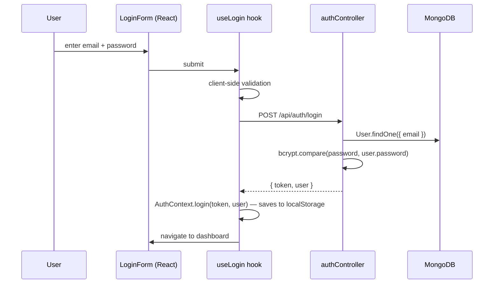
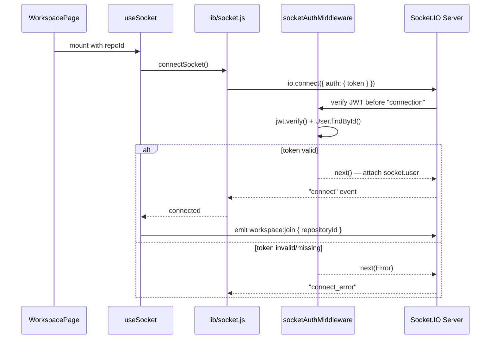
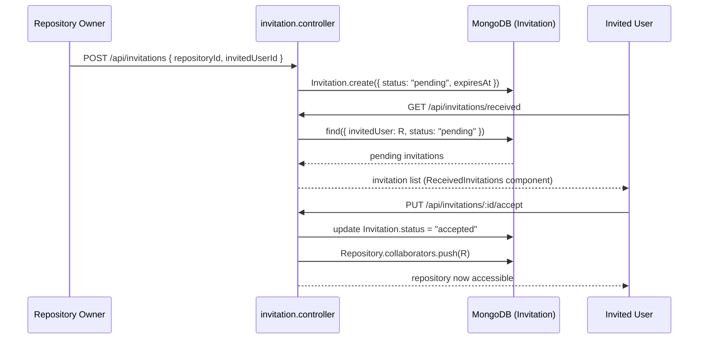

# Application Flow

**DevSync — Real-Time Collaborative Development Workspace**

*Documents the complete request lifecycle through the system. For component-level design, see the [TRD](2_TRD.md).*

---

## Table of Contents

- [HTTP Request Lifecycle](#http-request-lifecycle)
- [Authentication Flow](#authentication-flow)
- [Socket Connection & Handshake Flow](#socket-connection--handshake-flow)
- [Workspace Join Flow](#workspace-join-flow)
- [Real-Time File/Folder Mutation Flow](#real-time-filefolder-mutation-flow)
- [Real-Time Collaborative Editing Flow](#real-time-collaborative-editing-flow)
- [Invitation Flow](#invitation-flow)
- [Disconnect Flow](#disconnect-flow)

---

## HTTP Request Lifecycle

Every REST request follows the same top-level path before diverging into resource-specific logic:



Public routes (`/register`, `/login`) skip the `protect` middleware; every other route requires a valid JWT.

---

## Authentication Flow



On failure, `useLogin` maps the HTTP status to a specific message (invalid credentials, rate-limited, unreachable server) rather than a generic error.

---

## Socket Connection & Handshake Flow

A socket is only created when a user enters a repository workspace — not on login, registration, or the dashboard.



---

## Workspace Join Flow

```mermaid
sequenceDiagram
    participant Hook as useSocket (client)
    participant WS as workspace.socket.js
    participant Repo as Repository model
    participant PR as presence.socket.js
    participant Room as repo:&lt;id&gt; room

    Hook->>WS: workspace:join { repositoryId }
    WS->>Repo: Repository.findById(repositoryId)
    alt repository exists
        WS->>Room: socket.join(repo:<id>)
        WS->>WS: socket.data.currentRepository = repositoryId
        WS->>PR: onJoinRoom(repositoryId)
        PR->>PR: addToPresence() + broadcastPresence()
        PR-->>Room: presence:update { users, count }
        WS-->>Hook: workspace:joined { repositoryId, users }
    else repository not found
        WS-->>Hook: error { message: "Repository not found." }
    end
```

If the socket was already in a different repository room, `workspace.socket.js` leaves that room and fires `onLeaveRoom` before joining the new one, so a user is never counted as present in two repositories at once.

---

## Real-Time File/Folder Mutation Flow

Applies to creating, renaming, or deleting a file or folder. File and folder operations are persisted through REST, then broadcast over the socket layer.

```mermaid
sequenceDiagram
    participant U as User
    participant UI as WorkspacePage
    participant API as fileController / folderController
    participant DB as MongoDB
    participant IO as getIO() — Socket.IO instance
    participant Room as repo:&lt;id&gt; room

    U->>UI: create/rename/delete a file or folder
    UI->>API: POST/PUT/DELETE /api/files or /api/folders
    API->>API: verify requester is owner or collaborator
    API->>DB: persist change
    DB-->>API: saved document
    API->>IO: getIO().to(repo:<id>).emit(file:created / file:renamed / file:deleted, ...)
    IO-->>Room: event delivered to repo:<id>
    Room-->>UI: other clients' useSocket receives event
    API-->>UI: 200/201 response
    UI->>UI: reloadTree() — file tree refreshes without a manual refresh
```

The broadcast is fired directly from the controller after persistence, not from a separate socket handler — `handlers/file.socket.js` and `handlers/folder.socket.js` are unused placeholders in the current implementation.

---

## Real-Time Collaborative Editing Flow

Applies to keystrokes inside the Monaco editor.

```mermaid
sequenceDiagram
    participant A as User A (typing)
    participant Ed as useEditor (Client A)
    participant Sock as editor.socket.js
    participant Room as repo:&lt;id&gt; room
    participant B as User B (viewing same file)

    A->>Ed: types in Monaco editor
    Ed->>Sock: editor:change { repositoryId, fileId, content }
    Sock->>Sock: verify socket.data.currentRepository === repositoryId
    alt valid room membership
        Sock->>Room: broadcast editor:update { fileId, content } (excludes sender)
        Room-->>B: editor:update received
        B->>B: applyRemoteUpdate(fileId, content, activeTab)
    else room mismatch
        Sock->>Sock: reject silently, log warning
    end
```

`editor:join` is emitted first when a file is opened, recording `socket.data.activeFile` so future changes can be attributed and validated per file.

---

## Invitation Flow



Invitations left unanswered are automatically removed once `expiresAt` passes, via MongoDB's TTL index on the `Invitation` model — no manual cleanup job is required.

---

## Disconnect Flow

```mermaid
sequenceDiagram
    participant Client
    participant IO as Socket.IO Server
    participant WS as workspace.socket.js
    participant PR as presence.socket.js
    participant Room as repo:&lt;id&gt; room

    Client--)IO: connection drops (tab close, network loss, navigation)
    IO->>WS: "disconnect" event
    WS->>PR: onLeaveRoom(currentRepository)
    PR->>PR: removeFromPresence(repositoryId, socketId)
    PR-->>Room: presence:update { users, count }
    WS->>WS: clear socket.data.currentRepository / activeFile
```

Presence is deduplicated by `userId`, so if the same user still has another tab open in the same repository, they remain in the online list — only the specific `socketId` that disconnected is removed.