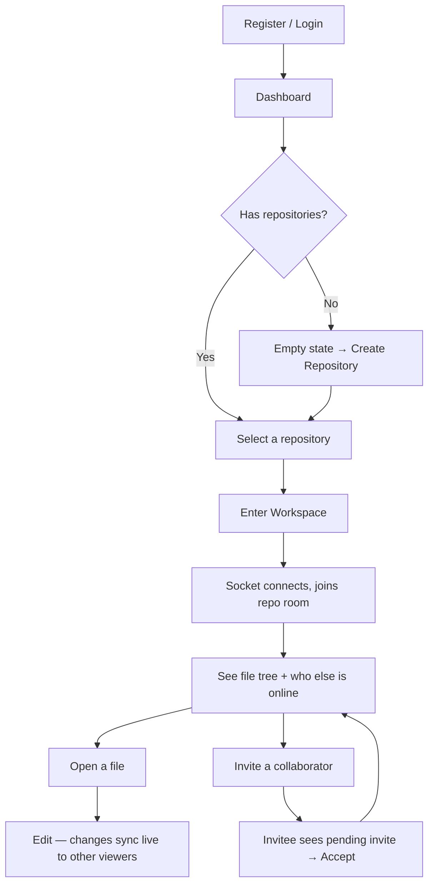

# UI/UX Design Brief

**DevSync — Real-Time Collaborative Development Workspace**

*Documents interface design decisions and rationale. For system architecture, see the [TRD](2_TRD.md).*

---

## Table of Contents

- [Design Philosophy](#design-philosophy)
- [Visual Language](#visual-language)
- [Layout](#layout)
- [User Journey](#user-journey)
- [Real-Time Feedback Design](#real-time-feedback-design)
- [Accessibility](#accessibility)
- [Future UI Improvements](#future-ui-improvements)

---

## Design Philosophy

The interface is designed around one principle: **feel like the editor developers already use, not like a generic web app wrapped around one.** Since the product's core value is real-time collaboration inside code, the workspace deliberately mirrors a VS Code–style layout — file explorer on the left, tabbed editor in the center, collaboration context on the right — so the collaborative layer sits on top of a mental model developers already have, instead of asking them to learn a new one.

Outside the workspace (auth, dashboard), the interface follows a calmer, standard dark-dashboard pattern — the density and editor-like chrome are reserved for the workspace itself, where they earn their place.

---

## Visual Language

DevSync uses a dark, developer-tool color palette consistent across every screen:

| Token | Value | Usage |
|---|---|---|
| Background (base) | `#0D1117` | App and editor background |
| Background (panel) | `#161B22` | Sidebars, cards, navbars |
| Border | `#30363D` | Panel dividers, card outlines |
| Text (primary) | `#E6EDF3` | Headings, primary content |
| Text (muted) | `#8B949E` / `#484F58` | Secondary labels, placeholders |
| Accent | `#7C5CFC` | Primary actions, active states, focus rings |
| Error | `#F85149` | Error states, destructive actions |

This palette is intentionally close to familiar code-editor themes, reinforcing that DevSync is a place to *work*, not a marketing surface.

---

## Layout

### Dashboard
| Region | Contents |
|---|---|
| Header | Branding, user context, "Create Repository" action |
| Main grid | Repository cards (name, description, collaborator count, last updated) |
| Empty state | Shown when a user has no repositories yet, with a direct call to action |

### Workspace
| Region | Contents |
|---|---|
| Top bar | Repository name, live sync status, online-collaborator count |
| Left panel | File explorer — tree view with inline create/rename, right-click context menu |
| Center panel | Tabbed Monaco editor — open files as tabs, active file rendered below |
| Right panel | Presence list (who's online), invite form, received invitations |
| Status bar | Online count, active file name, app identity |

The three-panel workspace layout stays fixed at 100vh with independently scrolling regions, so the editor never gets pushed off-screen by a long file tree or a long collaborator list.

---

## User Journey

A user never has to manually configure a connection or a sync state — entering a workspace is the only action required to start collaborating; the socket connection, room join, and presence broadcast all happen automatically on mount.

---

## Real-Time Feedback Design

Because the product's entire value is *live* collaboration, the interface is careful to always make sync state visible rather than assumed:

- **Sync status** in the top bar reflects the actual socket connection state (connected / syncing / error), not just whether the page loaded.
- **Presence list** updates the moment a collaborator joins or leaves — there is no "refresh to see who's online."
- **File tree changes** from other collaborators (create/rename/delete) trigger an automatic tree reload, so a user never edits against a stale structure.
- **Remote edits** in the editor apply directly to the open file, distinguished internally from local typing (via an "ignore remote change" flag) so a collaborator's incoming update never gets mistaken for the user's own keystroke and re-broadcast in a loop.

---

## Accessibility

- Sync/connection state is paired with both text and color (e.g. "Connected" / "Syncing" / "Error" labels, not a bare colored dot), so state is never conveyed by color alone.
- Interactive elements (file tree nodes, tabs, context menu items, buttons) support keyboard focus and hover states with sufficient contrast against the dark background.
- Destructive actions (deleting a file or folder) require an explicit confirmation before executing.

---

## Future UI Improvements

- Breadcrumb navigation above the editor for quickly locating the active file's path within nested folders (`BreadcrumbNav.jsx` is currently an unimplemented placeholder)
- An explicit export action in the workspace toolbar once ZIP export is implemented (`ExportButton.jsx` is currently an unimplemented placeholder)
- A dedicated, styled repository list view for the dashboard beyond individual repo cards (`RepoList.jsx` is currently an unimplemented placeholder)
- Responsive layout for narrower viewports — the current three-panel workspace targets desktop use, consistent with its role as a coding tool