# Backend Schema

**DevSync — Real-Time Collaborative Development Workspace**

*Documents the core Mongoose data models, why each exists, and how they relate. For real-time behavior built on top of them, see the [TRD](2_TRD.md#real-time-design).*

---

## Table of Contents

- [Storage Model](#storage-model)
- [User](#user)
- [Repository](#repository)
- [Folder](#folder)
- [File](#file)
- [Invitation](#invitation)
- [Presence (In-Memory, Not Persisted)](#presence-in-memory-not-persisted)
- [Relationships](#relationships)

---

## Storage Model

DevSync persists all durable state in MongoDB via Mongoose schemas. One category of state — live presence — is deliberately **not** stored in MongoDB; it lives only in server memory for the lifetime of active socket connections (see [Presence](#presence-in-memory-not-persisted)).

---

## User

```js
{
  username:     String,   // required, trimmed
  email:        String,   // required, unique, lowercase, trimmed
  password:     String,   // required — bcrypt hash, never plaintext
  profileImage: String,   // default: ""
  timestamps:   true,     // createdAt, updatedAt
}
```

**Why it exists**: the identity backing both REST authentication and the Socket.IO handshake. The same `User._id` is embedded in the JWT issued at login and used to resolve `req.user` (REST) and `socket.user` (sockets) on every subsequent request.

---

## Repository

```js
{
  name:          String,                                  // required, trimmed
  description:   String,                                  // default: ""
  owner:         ObjectId → User,                          // required
  isPublic:      Boolean,                                  // default: true
  collaborators: [ObjectId → User],                        // default: []
  timestamps:    true,
}
```

**Why it exists**: the core unit of collaboration in the product. Access control is a direct membership check — a user may act on a repository if they are the `owner` or present in `collaborators` — rather than routed through a separate permissions table. This keeps authorization checks in `repositoryController`, `fileController`, and `folderController` a single array/equality check rather than a join query.

**Note**: a dedicated `Collaborator` model exists in the codebase (`models/Collaborator.js`) but is currently an empty, unused stub — collaborator membership is handled entirely through the `collaborators` array on this model.

---

## Folder

```js
{
  name:         String,                    // required, trimmed
  repository:   ObjectId → Repository,      // required
  parentFolder: ObjectId → Folder,          // default: null — null means root-level
  createdBy:    ObjectId → User,            // required
  timestamps:   true,
}
```

**Why it exists**: folders are self-referential via `parentFolder`, which is what allows an arbitrarily nested file tree per repository without a separate path-string or materialized-path scheme. A `null` `parentFolder` marks a folder as living at the repository root.

---

## File

```js
{
  name:       String,                   // required, trimmed
  content:    String,                   // default: '' — the actual file text
  repository: ObjectId → Repository,     // required
  folder:     ObjectId → Folder,         // default: null — null means root-level
  createdBy:  ObjectId → User,           // required
  timestamps: true,
}
```

**Why it exists**: unlike a typical Git-backed system, a `File` document stores its content directly and is the live, single source of truth — there is no separate "committed" version. Real-time edits update this same document's `content` field, so what's persisted is always what every collaborator is currently seeing.

---

## Invitation

```js
{
  repository:   ObjectId → Repository,                 // required
  invitedBy:    ObjectId → User,                        // required
  invitedUser:  ObjectId → User,                        // required
  status:       String,  // "pending" | "accepted" | "rejected", default: "pending"
  expiresAt:    Date,                                   // optional
  timestamps:   true,
}
```

**Indexes**:
- `{ invitedUser: 1, status: 1 }` — serves the most frequent query, "a user's pending invitations."
- `{ repository: 1, invitedUser: 1 }` — checks for an existing pending invite before creating a duplicate, and serves "all invitations sent for a repository."
- `{ expiresAt: 1 }` with `expireAfterSeconds: 0` — a MongoDB TTL index that automatically deletes an invitation once `expiresAt` passes, with no manual cleanup job required. Invitations without an `expiresAt` are unaffected.

**Why it exists**: separates "has been invited" from "is a collaborator" as an explicit, auditable state machine (`pending → accepted/rejected`), rather than adding a user straight to `Repository.collaborators` on invite. Accepting an invitation is the only path that pushes a user into that array.

---

## Presence (In-Memory, Not Persisted)

```js
// presenceStore — held in server memory, not MongoDB
{
  [repositoryId]: Map {
    [socketId]: { userId, username, socketId, joinedAt }
  }
}
```

**Why it isn't a Mongoose model**: presence is a property of *live connections*, not durable application state. It resets correctly on every server restart, since every socket disconnects at that same moment. Keying by `socketId` (not `userId`) lets one user with multiple open tabs be tracked individually per tab, while `getPresenceList()` deduplicates by `userId` at read time so they still appear once in what collaborators see.

---

## Relationships

```mermaid
erDiagram
    USER ||--o{ REPOSITORY : owns
    USER }o--o{ REPOSITORY : "collaborates on"
    REPOSITORY ||--o{ FOLDER : contains
    REPOSITORY ||--o{ FILE : contains
    FOLDER ||--o{ FOLDER : "nests (parentFolder)"
    FOLDER ||--o{ FILE : contains
    USER ||--o{ FILE : creates
    USER ||--o{ FOLDER : creates

    REPOSITORY ||--o{ INVITATION : "has"
    USER ||--o{ INVITATION : "sends (invitedBy)"
    USER ||--o{ INVITATION : "receives (invitedUser)"

    REPOSITORY ||--o| PRESENCE_STORE : "tracked in-memory by"
```



A `Repository` is the hub every other durable model hangs off of — `Folder` and `File` reference it directly, and access is gated by the `owner`/`collaborators` relationship rather than a separate junction collection. `Invitation` is the only model that mediates between two `User` documents and a `Repository` without directly mutating either until accepted. The in-memory presence store is keyed by `repositoryId` but deliberately lives outside this persisted graph entirely.